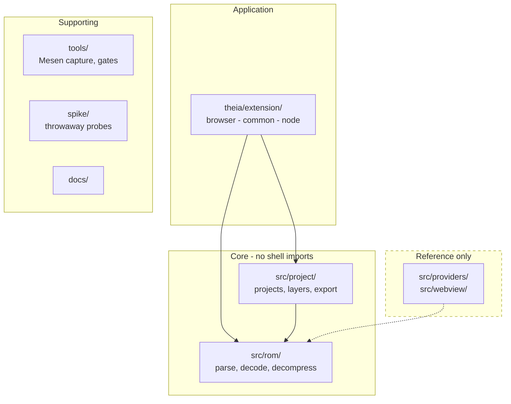

# Codebase map

Where things live, and which tests cover them. Read
[overview.md](overview.md) first for why the tree is shaped this way.

## The map



## Directory by directory

| Path | What it is | New work here? |
|------|-----------|----------------|
| `theia/extension/` | the application: widgets, commands, RPC servers | yes |
| `src/rom/` | ROM parsing and decoding, no shell imports | yes |
| `src/project/` | `.hbproj`, layer stack, working copy, IPS export | yes |
| `src/providers/`, `src/webview/`, `src/extension.ts` + its `src/`-root helpers | the original VS Code extension | no, reference only |
| `test/suite/` | the Vitest suite | yes |
| `tools/` | Mesen capture scripts, the commit gates | as needed |
| `spike/` | throwaway probes, kept for their findings | no |
| `docs/` | this documentation | yes |

## The one rule about imports

`src/rom/` and `src/project/` import **no shell**. No Theia, no VS Code.
This is what makes the core testable without starting an application, and it
is why the Theia backend can import the core directly while its frontend
cannot import anything that touches a file. Some modules restate the rule in
their header; it holds whether or not a given file says so.

## Tests

```
test/suite/
  unit/          pure functions, synthetic inputs
  integration/   multi-module, mostly ROM-gated
  provider/      the VS Code provider layer
  gates/         oracles that prove a gate can fail: lint, ROM terminology,
                 working copy, test registration
  support/       synthetic ROM builders, stubs
theia/browser-app/test/   the Playwright specs
```

File counts are deliberately absent. The ones that used to be here were
wrong within a day of being written.

```bash
npm run test:unit                                          # the whole suite
npx vitest run test/suite/unit/GraphicsDecoder.test.ts     # one file
```

The Playwright end-to-end specs live **here**, under
`theia/browser-app/test/`. What lives in the private
`en-gen/hackbench-playwright` repo is the ROM and the runner: `e2e-dispatch`
passes a `hackbench_ref` and the remote run checks out these specs against
it. That is why the suite does not run in `ci.yml`, where there is no ROM,
and why a full Theia install and frontend bundle does not block an ordinary
pull request.

### CI has no ROM

This is the single most important thing to understand about testing here.
`test/roms/` is gitignored, so **CI is permanently the corpus-absent case**.
A safeguard proven only by ROM-backed tests is unproven where it
actually runs.

Two consequences:

- Every gate, refusal and bounds check gets a **synthetic** fixture. Build
  the bytes in the test; do not reach for a ROM.
- Gate with `describe.skipIf`, never by generating cases from a corpus
  listing. `for (const file of romFiles)` over an empty array registers
  nothing, so the cases do not skip, they cease to exist: green run, zero
  skips, and the cases silently gone. Most of the suite already does this
  correctly, and `test/suite/gates/testRegistrationGate.test.ts` is what
  holds that line.

Report skipped counts both with and without a ROM. A count that is
identical either way means the tests need no ROM, or they are not
registering at all, and those look the same from outside.

### Oracles must be provable

Any check that reports a verdict needs a committed test proving it goes red
on a planted defect. `test/suite/gates/` exists for exactly this: the lint
gate has a test that plants a defect per rule and proves both halves fail.

## Commit gates

Enable the hooks once per clone:

```bash
git config core.hooksPath .githooks
```

Two scripts run on pre-commit and in CI:

- `tools/scripts/check-staged-style.sh` runs ESLint at `--max-warnings 0`
  and Prettier in check mode over staged JS/TS/CSS. Warnings are fatal.
- `tools/scripts/check-staged-content.sh` blocks ROM-derived bytes and
  em-dashes in newly added lines.

## Everyday commands

```bash
npm run lint
```

```bash
npm run format
```

```bash
npm run test:unit
```

```bash
npm run typecheck:theia
```

## Related reading

- [../testing.md](../testing.md) - the full testing guide and legal position
- [../glossary.md](../glossary.md) - domain vocabulary
- [../../CONTRIBUTING.md](../../CONTRIBUTING.md) - branch strategy, PR checklist
