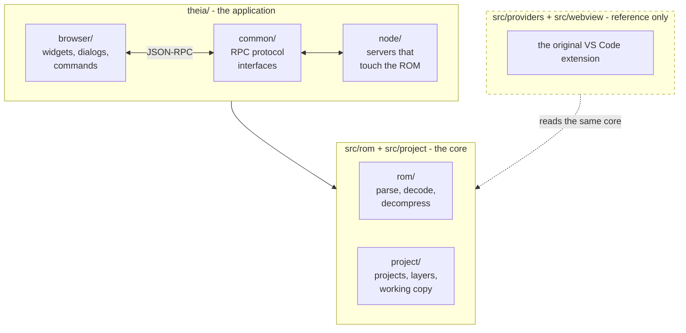
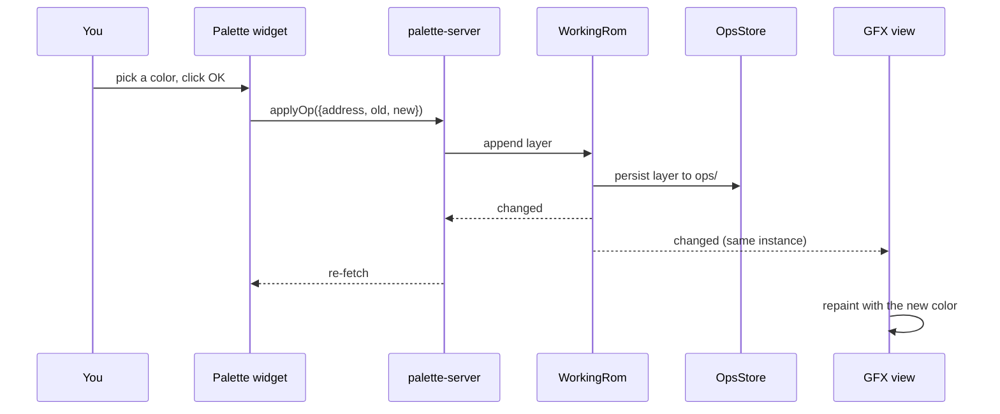

# Architecture overview

HackBench is a desktop application built on [Eclipse Theia][theia] and
Electron. It reads a Super Mario World ROM, shows you what is in it,
and records your edits as an ordered stack of patch layers that never touch
the ROM itself.

[theia]: https://theia-ide.org/

## The three trees

**`src/rom/` and `src/project/` are the core.** Plain TypeScript with no
Theia and no VS Code imports, so every one of them is testable without
starting a shell. This is enforced by convention and stated at the top of
each module. Everything that knows how to read a ROM lives here.

**`theia/` is the application.** It consumes the core and adds the user
interface. See [theia-shell.md](theia-shell.md).

**`src/providers/` and `src/webview/` are the original VS Code extension.**
HackBench started there and has since changed course. The tree is kept
because it holds a large body of working ROM interpretation, which is the
expensive part to get right, and it still builds and tests in CI. It is not
a shipping target and receives no new features.

## What the core does

| Area | Modules | Responsibility |
|------|---------|----------------|
| Addressing | `addressing.ts`, `RomFile.ts` | LoROM address to file offset, copier headers |
| Tables | `SmwRom.ts`, `LevelCatalog.ts`, `MapTree.ts` | pointer tables, the map list, headers |
| Compression | `LcLz2.ts`, `LcRle1.ts` | the ROM's own decompressors |
| Graphics | `GfxLoader.ts`, `GraphicsDecoder.ts` | 2BPP/3BPP/4BPP tiles, BGR555 to RGBA |
| Palettes | `PaletteLoader.ts`, `PaletteOp.ts` | CGRAM rows, per-level overrides, color ops |
| Maps | `LevelParser.ts`, `ObjectExpander.ts`, `model/` | object and sprite streams, composition |
| Projects | `project/` | `.hbproj`, layer stack, working copy, export |

## How a ROM becomes pixels

A ROM on disk is read once into base bytes; the layer stack is applied over
them to make the working copy; the node servers decode from that on demand
and hand results to the widgets over JSON-RPC.

A view that shows ROM content is supposed to read the **working copy**,
never the base bytes. That is what makes a palette edit show up immediately
in an already-open GFX sheet: both read the same `WorkingRom` instance,
handed out by `WorkingRomRegistry`.

Palette, GFX and Map16 are migrated. The Maps view is **not**:
`project-server.ts`'s `mapDetails` and `loadMaps` still call
`RomFile.load` directly, which is why
`test/suite/gates/workingCopyGate.test.ts` exempts that one file by name.
So it is a rule with one outstanding exception, not a description of the
current code. See [../glossary.md](../glossary.md), "Working copy".

## The edit model is a flux loop

`src/project/WorkingRom.ts` states the shape directly: an op is the action,
appending a layer is the dispatch, `WorkingRom` is the store, and the
widgets are views that re-render on its change event.

There are two distinct notification paths, server to frontend and server to
server, and [theia-shell.md](theia-shell.md) is where they are set out.

Layer ordering is a contract rather than an implementation detail;
[project-format.md](project-format.md) states it.

## Where the bytes are allowed to live

The project format carries no ROM bytes at all, and that falls out of the
design rather than being a policy applied on top. The one deliberate
exception is the op format itself.
[project-format.md](project-format.md) explains both.

## Related reading

- [project-format.md](project-format.md) - what a `.hbproj` is
- [theia-shell.md](theia-shell.md) - how the application is assembled
- [codebase-map.md](codebase-map.md) - where things live, and what tests run where
- [../glossary.md](../glossary.md) - the domain vocabulary, which is not optional
