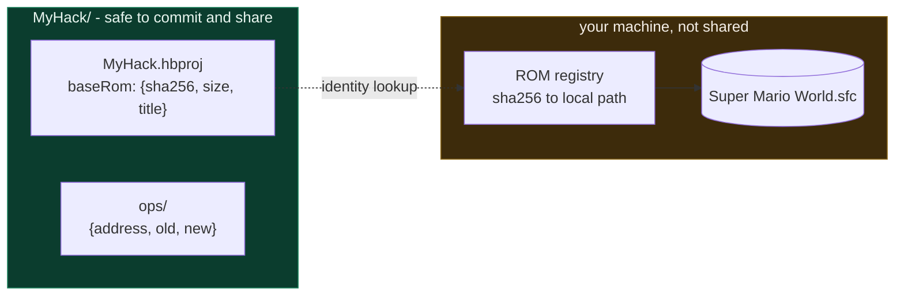
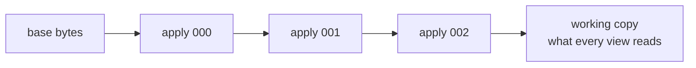

# The project format

A HackBench project is a **hack, not a workspace**. It describes the changes
you are making to a ROM. It does not contain the ROM.

## Why the ROM is referenced, not copied



The manifest records the base ROM by **identity**: sha256, size
without any copier header, and title. It records no path, because where the
ROM lives is a per-machine fact. That separation is what makes a project
safe to share: two contributors with legally obtained ROMs of the same
revision can work on one project, and the committed bytes are identical for
both regardless of what either of them named their file.

When you open a project whose ROM is not registered on this machine,
HackBench asks you to locate it rather than failing. The registry
re-validates on every resolve, because you can move or replace a file
underneath a stale entry.

You can also move the registration without waiting for a failure: **Project
Properties...** has a **Local workstation** section with the registered ROM
and emulator core paths, each with **Browse...**. A ROM pick is hashed on
the backend and refused if it is not this project's base ROM (both hashes
are shown); retargeting a project to a different ROM is not possible. The
core pick uses the same validation as `Change Emulator Core...`, and the core
registry holds one core per machine, so it applies to every project. Nothing
is written until Save; Cancel discards both picks.

## Layout

One manifest at the root of the data it describes, the way `package.json`
sits at the root of a package. Directory names are **fixed**, never derived
from the project name, so renaming the manifest cannot orphan the data.

```
MyHack/
  MyHack.hbproj      the manifest
  ops/               the layer stack, one file per layer
    000.json
    001.json
    redo/            layers that undo took back off the stack
  levels/            created with the project
  snapshots/         created with the project
  export/            .bps output from Export Patch (.ips optional)
  saves/             the emulator's save game (SRAM: the game's own progress
                     data, not ROM content; see SaveStore.ts)
  meta/              user metadata, one JSON file per concern
    aliases.json     user-supplied names (ROM ids to names; see Aliases.ts)
```

`ops/`, `export/` and `meta/` are created on first use. `levels/` and
`snapshots/` are created when the project is created; `levels/` currently
doubles as the sentinel that tells `openProject` the manifest has not been
moved away from its data. Neither holds layer content today: the live stack
is `ops/`.

The manifest holds project identity: the base ROM plus the hack's name,
title, summary, authors and version. `meta/` holds user metadata that never
becomes ROM bytes, one JSON file per concern, through `ProjectMeta.ts`.

## What a layer looks like

One file per layer, named by a zero-padded stack index, so directory order
**is** stack order with no separate manifest to drift from it. Each file
holds `{ id, label, ops }`, hand-formatted so every op sits on its own line,
because that is the reviewable unit and a diff should show exactly the ops
that changed.

An op is `{ address, old, new }`. Carrying `old` is what makes the stack
portable: clone the project on another machine and undo still works, with no
dependency on the machine that made the edit.

Undo does not delete. A layer taken off the stack moves to `ops/redo/`, same
format and same naming, so a redo survives closing the project. It nests
inside `ops/` so everything op-shaped lives under one directory, and the
applied-stack reader is unaffected because it filters to `.json` and a
directory is not one.

A new edit writes its layer as `NNNN.json.tmp`, clears `ops/redo/`, then renames the
file to `NNNN.json`. A write that fails before the clear therefore keeps the redo
history, and a stray `.tmp` after a crash is not a layer (the reader keeps an
exact `.json` suffix).

A project created before `ops/` existed reads back as an empty stack rather
than an error.

## The working copy



Layers apply one at a time, in stack order, onto the running result. They
are not flattened to "last write per offset wins". Palette ops never overlap
today, since each is an isolated two-byte word write, but sequential replay
is a contract of the working copy rather than a property of the current op
type.

The byte mutation itself is a pure reducer in `src/rom/PaletteOp.ts`: no
I/O, no project, no ROM on disk. `WorkingRom` is the orchestration
around it, and views dispatch by appending or popping layers. They never
write bytes any other way.

## Export

**Export Patch** diffs the base ROM against the exportable working
copy and writes a real `.bps` (`.ips` on request) under `export/`.

Two details matter:

- A preview layer, such as the state mid-drag in a color picker, is **not**
  exportable and never ships.
- Offsets are file offsets from the start of the base file, copier header
  included when the ROM has one. The patch therefore applies to the same
  file variant, headered or not, that the project was built against.

Exporting with no edits succeeds and produces an empty patch. Exporting from
a project whose ROM is not on this machine fails, because there is
nothing to diff against.

## The copyright position

A project contains no ROM-derived bytes, so it can go in a public
repository. The only ROM-derived output HackBench produces is the
emulator cache (savestates, heap offsets), and that lives in per-user
application data keyed by ROM hash and core identity, not in the project.

The deliberate exception is the op format: `address`, `old` and `new` are
ROM-derived hex words of two or three bytes each. That is traded in
the owner's favor for portable undo. See [../testing.md](../testing.md)
and the repository's content policy for the rule this bends and why.

## Related reading

- [overview.md](overview.md) - how the project layer fits the whole
- [../guide/getting-started.md](../guide/getting-started.md) - creating one
- [../glossary.md](../glossary.md) - "Working copy", "Op", and friends
