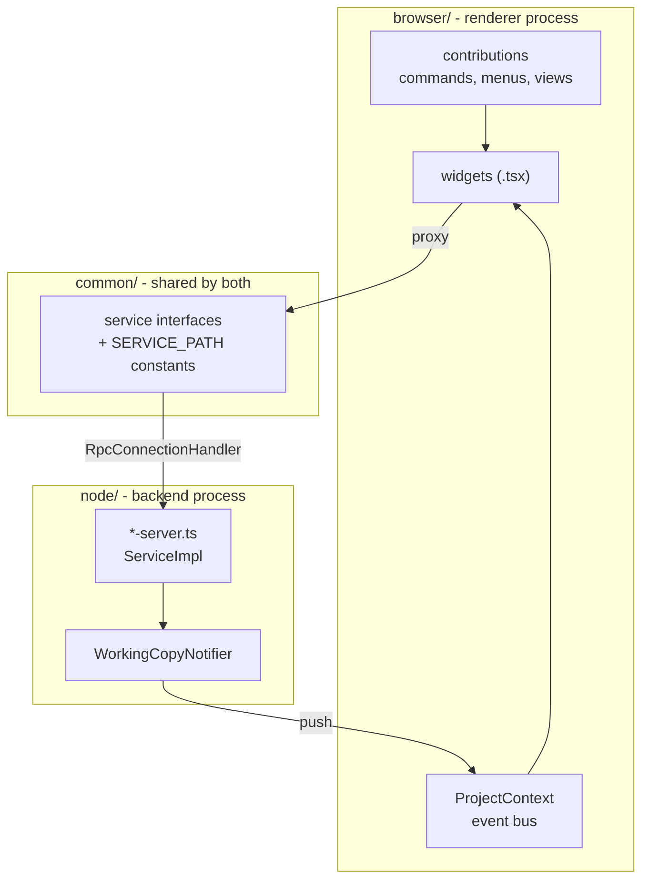
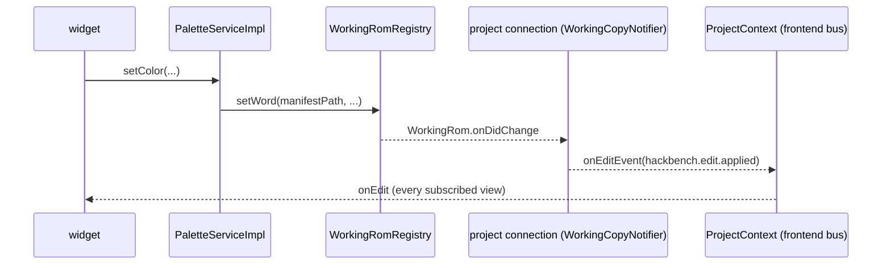

# The Theia shell

`theia/` is the HackBench application. It is a [Theia][theia] monorepo laid
out the way [Composing Applications][compose] describes.

[theia]: https://theia-ide.org/
[compose]: https://theia-ide.org/docs/composing_applications/

```
theia/
  extension/      hackbench-theia-extension, all the actual code
  electron-app/   the desktop target - this is the shipping form
  browser-app/    the same extension in a browser, used by the e2e suite
  no-native/      stubs for native modules the desktop build does not need
```

## Six extensions, one package

`extension/package.json` declares six `theiaExtensions` entries, each a
frontend and backend pair:

| Extension | Frontend                  | Backend         | Service path                   |
| --------- | ------------------------- | --------------- | ------------------------------ |
| hackbench | shell, projects, commands | project server  | `/services/hackbench-project`  |
| palette   | palette view              | palette server  | `/services/hackbench-palette`  |
| music     | audio view (BGM and SFX)  | music server    | `/services/hackbench-music`    |
| gfx       | graphics view             | GFX server      | `/services/hackbench-gfx`      |
| map16     | Map16 tile editor         | Map16 server    | `/services/hackbench-map16`    |
| emulator  | emulator view             | emulator server | `/services/hackbench-emulator` |

They are separate because each owns a view, a protocol and a server that can
be reasoned about on its own, not because Theia requires it.

## The three-way split



`common/` is the contract. It holds the service interface and the
`SERVICE_PATH` constant, and it is imported by both sides, so a protocol
change breaks the compile rather than the runtime.

`node/` is the only side allowed to touch the ROM. It imports the core
directly (`src/rom/`, `src/project/`) and decodes on demand.

`browser/` never reads a file. It asks over JSON-RPC and renders what comes
back.

## How a service is wired

hackbench - the only service that pushes to a client - binds its
`ProjectServiceImpl` inside a `ConnectionContainerModule`
(`@theia/core/lib/node/messaging/connection-container-module`), not as a
plain backend-container singleton. Theia gives every top-level connection
(one browser tab, one window) its own CHILD container built from that
module, so each connection resolves its own `ProjectServiceImpl` and its own
client - **this connection's own proxy back to the frontend**, never shared
with another window. `WorkingRomRegistry` is the one thing these still
share: it stays bound in the PARENT container, and the per-connection child
resolves it there, which is what keeps an edit made through one window
visible to every other window and view on the same project.

`palette`, `gfx`, `map16`, `music` and `emulator` have no client (no
`setClient` in their protocol), so they are ordinary backend-container
singletons. They push nothing: an edit they make reaches every view through
the project connection (below).



## Notification paths

This catches people out, so it is worth stating plainly. Everything the
backend tells the frontend leaves on ONE connection, the project service's,
as one of two events, and arrives on one bus, `ProjectContext`. No other
service has a client.

**Edit event** (`ProjectContext.onEdit`). A CloudEvents-shaped envelope
(`src/project/EditEvent.ts`; the `cloudevents` package is imported for its
types only, and ESLint refuses a value import). `type` is
`hackbench.edit.applied` (an edit, a redo) or `hackbench.edit.reverted` (an
undo, or the rollback of an edit that never reached disk). `subject` is the
manifest path. `data` is `{ domain, ranges }`: `domain` is `palette`,
`map16` or `gfx`; `ranges` are half-open `[start, end)` **file offsets** into
the working copy's bytes (a copier header counts; they are not SNES
addresses), coalesced, and empty for a gfx layer, which is addressed by file
and character. Palette and Map16 are told apart by the op's `mask`: Map16
always writes the full word, a colour never carries a mask, and that survives
a reload where a field on the layer would not.

It is built in one place. `WorkingCopyNotifier` is the only
`WorkingRom.onDidChange` subscriber under `theia/extension/src/node`: the
project service's `ProjectConnection` gives every working copy the registry
holds, now or built later (`WorkingRomRegistry.onWorkingCopy`), to its
per-connection notifier, and lets go of a copy the registry replaces.
`watch` is idempotent per `WorkingRom` instance, keyed by a `Map` from that
instance to its unsubscribe function, so a single edit fires the client once.
`setClient(undefined)` (wired to the client proxy's `onDidCloseConnection`)
calls every stored unsubscribe function, so a closed window's dead proxy is
never called again. A palette edit repainting an open GFX sheet is therefore
this one event, not a call between servers.

**ROM changed** (`ProjectContext.onRomChanged`, #576). A separate event with
the manifest path as payload, because it asks a view to rebuild from scratch
where an edit asks it to re-read.
`WorkingRomRegistry.onRomChanged` fires once per project when:

- `relocate` swaps the ROM path (Project Properties);
- `register` serves a project that was waiting for its ROM (the emulator's
  "Locate ROM...");
- a `get` finds the ROM of a project that was waiting for it (it reappeared
  without `register` or `relocate`), so a view stuck on "Locate" refreshes.
  Evidence scope: `WorkingRomRegistry.get()` keeps the waiting marker until the
  copy is built; synthetic ROMs on one machine, pinned by two tests in
  `test/suite/unit/RomChangedEvent.test.ts` ("a waiting project served by a
  later get() is announced once, and a later register adds nothing" and "a
  waiting project whose layer is unreadable keeps waiting; the get that
  finally builds it fires once"), each seen red against the code without the
  behaviour;
- a rebuild replaces an existing cache entry (a header flip, or layers
  rewritten under it).

It does not fire on the first build, on a cached read, or on an edit.
`RomChangedNotifier` (per connection, released by `setClient(undefined)`)
pushes it as `ProjectServiceClient.onRomChanged`. This event is deliberately
not a CloudEvent.

| Subscriber                                      | Edit (`onEdit`)                       | ROM changed (`onRomChanged`)                        |
| ----------------------------------------------- | ------------------------------------- | --------------------------------------------------- |
| Palettes explorer                               | rebuild, keeps which groups were open | rebuild as a fresh open: nothing selected, defaults |
| Maps, Graphics, Audio explorers                 | not subscribed (see below)            | rebuild as a fresh open                             |
| Map, Map16, GFX, Palette-group, Overworld views | re-read                               | re-read                                             |
| Emulator, Edit menu                             | stale check / refresh                 | refresh                                             |

The Maps, Graphics and Audio explorers do not subscribe to edits because their
rows come from tables that palette and Map16 word edits do not write, not
because an edit can never matter: a GFX Save may change a GFX file's listing,
and the Graphics explorer picks that up only on its next load. That is a
known gap, not a decision.

## Views

Five views, each with a focus command in the `HackBench` category.
**Maps**, **Graphics**, **Palettes** and **Audio** dock in the left
sidebar; the **Emulator** docks in the bottom panel beside Problems, so it
can sit below whatever you are editing.

Each view's side and ordering is its contribution's
`defaultWidgetOptions`, in `theia/extension/src/browser/*-contribution.ts`.
Read it there rather than trusting this paragraph: the emulator moved from
the main area to the right sidebar in #472, then to the bottom panel.
Project-level commands (`New Project...`, `Open Project...`, `Open Recent
Project...`, `Project Properties...`, `Export Patch`) live on the same
category and are reachable from the File menu.

Opening another project first closes every GFX, Map16 and map view of the old one
(the widgets that implement `ProjectBound`), through the shell so a view with
unsaved strokes asks. The switch aborts if any such view is still attached
afterwards (a cancelled prompt, or a Save that failed), because Theia reports
the close as done either way. A view still loading during the switch is
disposed when `PreviewTabs` would attach it (#628). The palette explorer and
the music, emulator and overworld views re-target on `ProjectContext.onChanged`;
palette group views close themselves there.

The map tab shows each screen as one composite canvas. The backend sends the
six plane canvases per screen plus two plane lists (main and sub, bottom to
top) and the CGADSUB and fixed color; the widget runs `composeScreen`
(`src/rom/model/ColorMath.ts`) over them on every layer toggle, so layer 3 and
the SNES color math draw on every non-Mode-7 level mode (#562). The plane
canvases stay in the DOM as the compositor's source, never seen. Rules and
evidence: `docs/rom/level-rendering.md`.

Views follow the active Theia theme rather than pinning their own colors,
which `theia/browser-app/test/load-maps.spec.cjs` asserts.

### The map tab's block content indicators (#566)

`ProjectService.mapBlockContents(manifestPath, index)` returns the distinct
16 x 16 item arts of a map (`arts`, by key) and where each item block shows
which (`indicators`: plane, map-pixel corner, art key), from the working copy,
with a plain-words `note` for blocks it does not draw. The tables' refusal
comes back as `unavailable` and the tab shows the reason.
The composite canvas of each screen stays native-size and is never given indicators. A screen that
holds one also has a display canvas (`data-layer="display"`) over it, which hides the composite and shows
the same picture at the zoom (`IndicatorDisplay`, `browser/map-view-model.ts`): the native composite
scaled up, with each indicator's block cell recomposed at the zoom, its planes scaled by nearest
sampling, its plane's indicators painted into the plane's copy and the planes stacked and put through
color math as ever. So hiding a graphics layer hides its indicators, and a nearer plane or a sprite covers an
indicator exactly as it covers its block. A hidden plane is left out of the plane set, not empty. A hover
change recomposes only the cells it touches (about 2 ms at 3x on a screen with three blocks, measured in
node), and the display is built once per screen and zoom. Screens with no indicator show the composite
itself. Hover is tracked on the scroller (`onPointerMove`, and re-found on scroll, zoom and new replies);
the topmost visible plane's block under the pointer expands. The display publishes the boxes it painted
in `data-indicators`.

### The map tab's sprite layer (#564)

`ProjectService.mapSprites(manifestPath, index)` returns every
sprite of a map as one RGBA bitmap in map pixels (`MapSpriteDto`: index, id,
anchor, `box`, base64 `rgba`, `status` of `drawn` or `placeholder`, and the
reason a marker is a marker: the interpreter's refusal (`refused: ...`), an
empty run (`drew no OAM tile`), or `extraBits` / `charsNotLoaded`), plus the
screen size and orientation. A drawn sprite may carry `unverified`: the level
loader refused this ROM, so the sprite ran from a placement-only seed, not the
level's state. The reply's `note` joins two caveats: the stream has no end
marker in the bytes read (sprites past them are not drawn), and, once per map,
that sprites were drawn unverified; the tab shows it.
`node/map-sprites.ts` is the pure module behind it; `project-server.ts`
reads the working copy through `WorkingRomRegistry`, as `mapScreen` does.
It is a separate call from `mapScreen` because a sprite is not cut at screen
edges: parts sit at the anchor plus the engine's `dx`/`dy`, negative and off
the 16 px grid. The frontend cuts each bitmap per screen
(`compositeSpriteScreen`, `browser/map-view-model.ts`) into one `sprites`
canvas per screen, stacked just under L1's priority plane. The `S` toggle
hides those canvases with `visibility: hidden`, as L1 and L2 do.

## The emulator view

The emulator runs a **libretro core that you supply**. HackBench ships no
core. The path to it is registered per machine, beside the ROM registry and
for the same reason: two contributors point at different local builds of the
same core, so it is never a project value.

A single entry rather than a map, since only one core drives the view at a
time, and the path is re-validated on every resolve.

The view is honest about its preconditions: with no project open it asks for
one, and with no core registered it offers to locate one.

## Running it

```bash
yarn --cwd theia install
```

```bash
yarn --cwd theia build
```

```bash
yarn --cwd theia start
```

`build` and `start` target Electron. The browser target is
`build:browser` and `start:browser`, which is what the Playwright suite
drives.

Type-checking the shell is a separate script from the root:

```bash
npm run typecheck:theia
```

It runs `tools/scripts/typecheck-theia.cjs`, which looks up TypeScript in
`theia/extension`, then `theia`, as yarn lays it out (theia's pinned 5.4.5, never the root's
6.x, so it matches CI's `yarn --cwd theia/extension typecheck`) and passes
extra arguments through. A fresh worktree needs
`yarn --cwd theia install --frozen-lockfile --ignore-scripts` first (it needs TypeScript in `theia/extension/node_modules` or
`theia/node_modules`); without it the script exits 1 and says so (#669).
`test/suite/gates/typecheckTheia.test.ts` covers the hint, the compiler
choice, path resolution, argument and exit-status pass-through with stub
compilers.

## Related reading

- [overview.md](overview.md) - how the shell relates to the core
- [codebase-map.md](codebase-map.md) - what tests cover this tree
