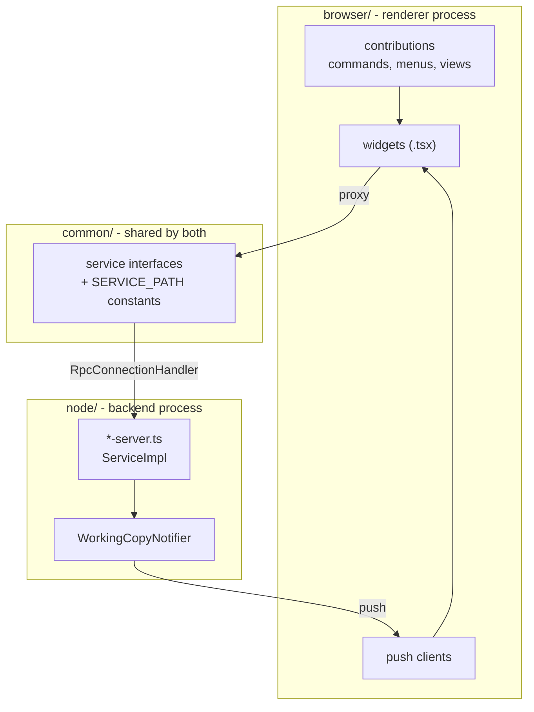
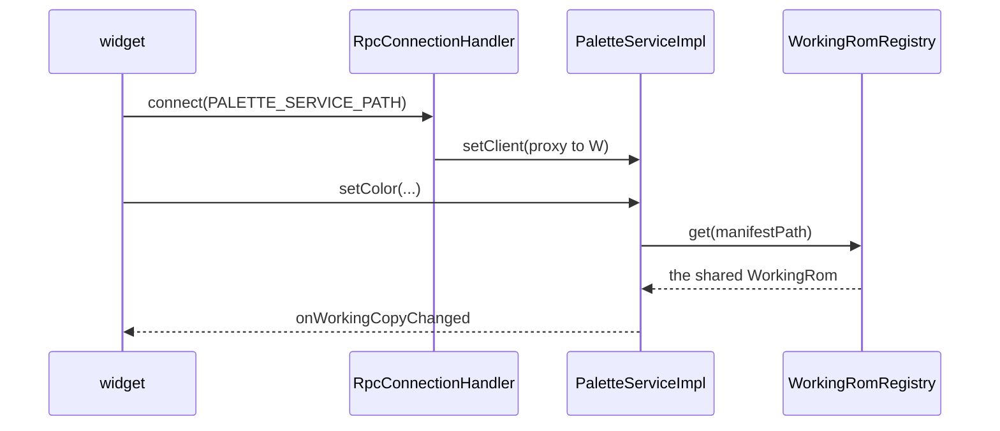

# The Theia shell

`theia/` is the HackBench application. It is a [Theia][theia] monorepo laid
out the way [Composing Applications][compose] describes.

[theia]: https://theia-ide.org/
[compose]: https://theia-ide.org/docs/composing_applications/

```
theia/
  extension/      hackbench-theia-extension, all the actual code
  electron-app/   the desktop target - this is the shipping form
  browser-app/    the same extension in a browser, used by the e2e suite
  no-native/      stubs for native modules the desktop build does not need
```

## Six extensions, one package

`extension/package.json` declares six `theiaExtensions` entries, each a
frontend and backend pair:

| Extension | Frontend | Backend | Service path |
|-----------|----------|---------|--------------|
| hackbench | shell, projects, commands | project server | `/services/hackbench-project` |
| palette | palette view | palette server | `/services/hackbench-palette` |
| music | audio view (BGM and SFX) | music server | `/services/hackbench-music` |
| gfx | graphics view | GFX server | `/services/hackbench-gfx` |
| map16 | Map16 tile editor | Map16 server | `/services/hackbench-map16` |
| emulator | emulator view | emulator server | `/services/hackbench-emulator` |

They are separate because each owns a view, a protocol and a server that can
be reasoned about on its own, not because Theia requires it.

## The three-way split



`common/` is the contract. It holds the service interface and the
`SERVICE_PATH` constant, and it is imported by both sides, so a protocol
change breaks the compile rather than the runtime.

`node/` is the only side allowed to touch the ROM. It imports the core
directly (`src/rom/`, `src/project/`) and decodes on demand.

`browser/` never reads a file. It asks over JSON-RPC and renders what comes
back.

## How a service is wired

Each backend module binds the implementation as a singleton and registers an
`RpcConnectionHandler` on its service path. The client handed to that
handler's factory is **this connection's proxy back to the frontend**.
Registering it is what lets a write push "re-render" to the widget that
opened it.



## Two notification paths

This catches people out, so it is worth stating plainly.

**Server to frontend** goes over JSON-RPC via `WorkingCopyNotifier`. Its
`watch` is idempotent per `WorkingRom` instance, keyed by a `WeakSet` rather
than a flag on the manifest path. `WorkingRomRegistry.get()` runs on every
request, so without that guard each call would add another subscriber and a
single edit would fire the client once per RPC call ever made.

**Server to server** is a different mechanism: a direct subscription against
the shared `WorkingRom` that both services get from the same registry. This
is how the GFX server learns about a palette edit and repaints an open sheet
with no round trip through the frontend.

## Views

Five views, each with a focus command in the `HackBench` category.
**Maps**, **Graphics**, **Palettes** and **Audio** dock in the left
sidebar; the **Emulator** docks in the bottom panel beside Problems, so it
can sit below whatever you are editing.

Each view's side and ordering is its contribution's
`defaultWidgetOptions`, in `theia/extension/src/browser/*-contribution.ts`.
Read it there rather than trusting this paragraph: the emulator moved from
the main area to the right sidebar in #472, then to the bottom panel.
Project-level commands (`New Project...`, `Open Project...`, `Open Recent
Project...`, `Project Properties...`, `Export Patch`) live on the same
category and are reachable from the File menu.

Views follow the active Theia theme rather than pinning their own colors,
which `theia/browser-app/test/load-maps.spec.cjs` asserts.

## The emulator view

The emulator runs a **libretro core that you supply**. HackBench ships no
core. The path to it is registered per machine, beside the ROM registry and
for the same reason: two contributors point at different local builds of the
same core, so it is never a project value.

A single entry rather than a map, since only one core drives the view at a
time, and the path is re-validated on every resolve.

The view is honest about its preconditions: with no project open it asks for
one, and with no core registered it offers to locate one.

## Running it

```bash
yarn --cwd theia install
```

```bash
yarn --cwd theia build
```

```bash
yarn --cwd theia start
```

`build` and `start` target Electron. The browser target is
`build:browser` and `start:browser`, which is what the Playwright suite
drives.

Type-checking the shell is a separate script from the root:

```bash
npm run typecheck:theia
```

## Related reading

- [overview.md](overview.md) - how the shell relates to the core
- [codebase-map.md](codebase-map.md) - what tests cover this tree
