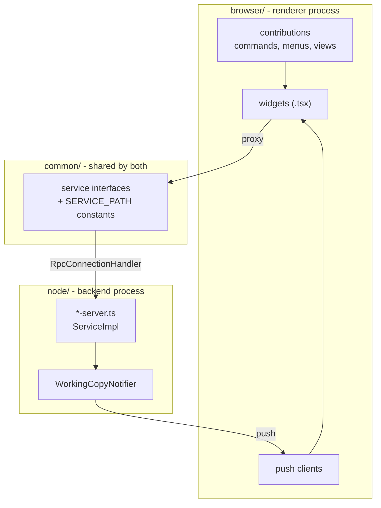
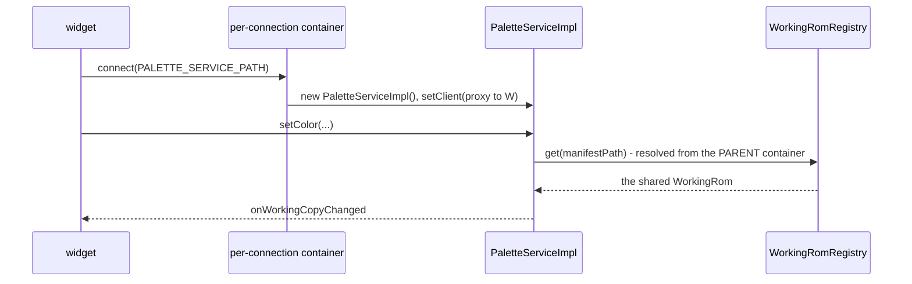

# The Theia shell

`theia/` is the HackBench application. It is a [Theia][theia] monorepo laid
out the way [Composing Applications][compose] describes.

[theia]: https://theia-ide.org/
[compose]: https://theia-ide.org/docs/composing_applications/

```
theia/
  extension/      hackbench-theia-extension, all the actual code
  electron-app/   the desktop target - this is the shipping form
  browser-app/    the same extension in a browser, used by the e2e suite
  no-native/      stubs for native modules the desktop build does not need
```

## Six extensions, one package

`extension/package.json` declares six `theiaExtensions` entries, each a
frontend and backend pair:

| Extension | Frontend | Backend | Service path |
|-----------|----------|---------|--------------|
| hackbench | shell, projects, commands | project server | `/services/hackbench-project` |
| palette | palette view | palette server | `/services/hackbench-palette` |
| music | audio view (BGM and SFX) | music server | `/services/hackbench-music` |
| gfx | graphics view | GFX server | `/services/hackbench-gfx` |
| map16 | Map16 tile editor | Map16 server | `/services/hackbench-map16` |
| emulator | emulator view | emulator server | `/services/hackbench-emulator` |

They are separate because each owns a view, a protocol and a server that can
be reasoned about on its own, not because Theia requires it.

## The three-way split



`common/` is the contract. It holds the service interface and the
`SERVICE_PATH` constant, and it is imported by both sides, so a protocol
change breaks the compile rather than the runtime.

`node/` is the only side allowed to touch the ROM. It imports the core
directly (`src/rom/`, `src/project/`) and decodes on demand.

`browser/` never reads a file. It asks over JSON-RPC and renders what comes
back.

## How a service is wired

hackbench, palette, GFX and Map16 - the four services that push to a
client - bind their `*ServiceImpl` inside a `ConnectionContainerModule`
(`@theia/core/lib/node/messaging/connection-container-module`), not as a
plain backend-container singleton. Theia gives every top-level connection
(one browser tab, one window) its own CHILD container built from that
module, so each connection resolves its own `*ServiceImpl` instance and its
own client - **this connection's own proxy back to the frontend**, never
shared with another window. `WorkingRomRegistry` is the one thing these
still share: it stays bound in the PARENT container, and the per-connection
child resolves it there, which is what keeps an edit made through one
window visible to every other window and view on the same project.

`music` and `emulator` never push to a client (no `setClient` in their
protocol) and hold only machine-scoped, file-backed state (`CoreRegistry`,
`WorkingRomRegistry`), so they stay ordinary backend-container singletons.



## Two notification paths

This catches people out, so it is worth stating plainly.

**Server to frontend** goes over JSON-RPC via `WorkingCopyNotifier`. Its
`watch` is idempotent per `WorkingRom` instance, keyed by a `Map` from that
instance to its unsubscribe function, rather than a flag on the manifest
path. `WorkingRomRegistry.get()` runs on every request, so without that
guard each call would add another subscriber and a single edit would fire
the client once per RPC call ever made. `setClient` doubles as the
disconnect signal: passing `undefined` (wired to the client proxy's
`onDidCloseConnection` in each `*-backend-module.ts`) calls every stored
unsubscribe function and clears the map, so a closed window's dead proxy is
never called again.

**Server to server** is not a separate mechanism. `WorkingCopyNotifier` is
the only `WorkingRom.onDidChange` subscriber under `theia/extension/src/node`:
an open GFX or Map16 view has its own connection's instance `watch`ing the
same shared `WorkingRom` palette-server.ts writes through, and pushes to its
own client exactly as palette-server.ts's does. A palette edit repainting an
open GFX sheet is that instance's ordinary push, not a direct call between
servers.

## Views

Five views, each with a focus command in the `HackBench` category.
**Maps**, **Graphics**, **Palettes** and **Audio** dock in the left
sidebar; the **Emulator** docks in the bottom panel beside Problems, so it
can sit below whatever you are editing.

Each view's side and ordering is its contribution's
`defaultWidgetOptions`, in `theia/extension/src/browser/*-contribution.ts`.
Read it there rather than trusting this paragraph: the emulator moved from
the main area to the right sidebar in #472, then to the bottom panel.
Project-level commands (`New Project...`, `Open Project...`, `Open Recent
Project...`, `Project Properties...`, `Export Patch`) live on the same
category and are reachable from the File menu.

Opening another project first closes every GFX, Map16 and map view of the old one
(the widgets that implement `ProjectBound`), through the shell so a view with
unsaved strokes asks; cancelling that prompt aborts the switch (#628). Palette,
music, emulator and overworld views re-target on `ProjectContext.onChanged`
instead.

The map tab shows each screen as one composite canvas. The backend sends the
six plane canvases per screen plus two plane lists (main and sub, bottom to
top) and the CGADSUB and fixed color; the widget runs `composeScreen`
(`src/rom/model/ColorMath.ts`) over them on every layer toggle, so layer 3 and
the SNES color math draw on every non-Mode-7 level mode (#562). The plane
canvases stay in the DOM as the compositor's source, never seen. Rules and
evidence: `docs/rom/level-rendering.md`.

Views follow the active Theia theme rather than pinning their own colors,
which `theia/browser-app/test/load-maps.spec.cjs` asserts.

### The map tab's sprite layer (#564)

`ProjectService.mapSprites(manifestPath, index)` returns every
sprite of a map as one RGBA bitmap in map pixels (`MapSpriteDto`: index, id,
anchor, `box`, base64 `rgba`, `status` of `drawn` or `placeholder`, and the
reason a marker is a marker: the interpreter's refusal (`refused: ...`), an
empty run (`drew no OAM tile`), or `extraBits` / `charsNotLoaded`), plus the
screen size and orientation. A drawn sprite may carry `unverified`: the level
loader refused this ROM, so the sprite ran from a placement-only seed, not the
level's state. The reply's `note` joins two caveats: the stream has no end
marker in the bytes read (sprites past them are not drawn), and, once per map,
that sprites were drawn unverified; the tab shows it.
`node/map-sprites.ts` is the pure module behind it; `project-server.ts`
reads the working copy through `WorkingRomRegistry`, as `mapScreen` does.
It is a separate call from `mapScreen` because a sprite is not cut at screen
edges: parts sit at the anchor plus the engine's `dx`/`dy`, negative and off
the 16 px grid. The frontend cuts each bitmap per screen
(`compositeSpriteScreen`, `browser/map-view-model.ts`) into one `sprites`
canvas per screen, stacked just under L1's priority plane. The `S` toggle
hides those canvases with `visibility: hidden`, as L1 and L2 do.

## The emulator view

The emulator runs a **libretro core that you supply**. HackBench ships no
core. The path to it is registered per machine, beside the ROM registry and
for the same reason: two contributors point at different local builds of the
same core, so it is never a project value.

A single entry rather than a map, since only one core drives the view at a
time, and the path is re-validated on every resolve.

The view is honest about its preconditions: with no project open it asks for
one, and with no core registered it offers to locate one.

## Running it

```bash
yarn --cwd theia install
```

```bash
yarn --cwd theia build
```

```bash
yarn --cwd theia start
```

`build` and `start` target Electron. The browser target is
`build:browser` and `start:browser`, which is what the Playwright suite
drives.

Type-checking the shell is a separate script from the root:

```bash
npm run typecheck:theia
```

## Related reading

- [overview.md](overview.md) - how the shell relates to the core
- [codebase-map.md](codebase-map.md) - what tests cover this tree
